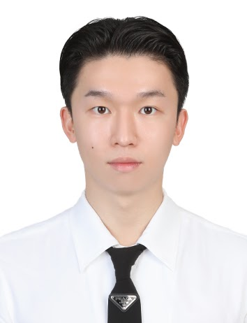

# Members

## 박사후연구원 (Postdoc.)

- ### 배영오 (Yeongo Bae)
  {width="350"}
    - 강북삼성병원 신경외과 전문의
    - 박사 후 연구원
    - 전공: 의학/머신러닝
    - 연락처: yobae05@gmail.com

- 

## 박사과정 (Doctoral Students)

- ### 김선엽 (Seonyeop Kim)
  {width="350"}
    - 석박통합과정
    - 전공: 데이터사이언스, 컴퓨터공학, 경영학
    - 연락처: paul5506@g.skku.edu

- ### 김준 (Jun Kim)
  {width="350"}
    - 박사과정
    - 전공: 의료IT공학
    - 연락처: saviour_sh@icloud.com

## 석사과정 (Master's Students)

- ### 이낭경 (Nangkyung Lee)
  {width="350"}
    - 석사 수료
    - 전공: 통계학
    - 연락처: skdrud3717@naver.com

- ### 장수호 (Suho Jang)
  {width="350"}
    - 석사과정
    - 전공: 의료정보학
    - 연락처: saviour_sh@icloud.com

- ### 전현지 (Hyunji Jeon)
  {width="350"}
    - 석사과정
    - 전공: 의료 인공지능, 헬스케어
    - 연락처: hgcy118@g.skku.edu

- ### 김종남 (Jongnam Kim)
  {width="350"}
    - 석사과정
    - 전공: 수학/데이터
    - 연락처: nyalyu22@g.skku.edu

- ### 설희승 (Heeseung Seol)
  {width="350"}
    - 석사과정
    - 전공: 전자공학
    - 연락처: gmltmd8@g.skku.edu

- ### 정운영 (Woonyoung Jung)
  {width="350"}
    - 석사과정
    - 전공: Time series analysis, Medical AI
    - 연락처: hbm06014@skku.edu

- ### 한채윤 (Chayoon Han)
  {width="350"}
    - 학석 연계 과정
    - 전공: 의료 인공지능
    - 연락처: polarlicht11@g.skku.edu

- ### 탁지수 (Jisoo Tak)
  {width="350"}
    - 석사과정
    - 전공: Medical AI
    - 연락처: jstak0804@g.skku.edu

- ### 김민영 (Minyoung Kim)
  {width="350"}
    - 석사과정
    - 전공: 디지털 AI헬스, Medical AI
    - 연락처: dbssus123@gmail.com

- ### 양희윤 (Heeyoon Yang)
  {width="350"}
    - 석사과정
    - 전공: 의료 융합 AI
    - 연락처: didgmldbs12@naver.com

- ### 이윤정 (Yoonjung Lee)
  {width="350"}
    - 석사과정
    - 전공: Medical AI
    - 연락처: aristata52@g.skku.edu

- ### 김선화 (Sunhwa Kim)
  {width="350"}
    - 석사과정
    - 전공: 임상의약, 디지털AI헬스
    - 연락처: kshcj132@gmail.com

- ### 채승범 (Seungbeom Chae)
  {width="350"}
    - 석사과정
    - 전공: 생명공학, 디지털AI헬스
    - 연락처: chaesb@skku.edu

- 

[//]: # (<!--)

## Laboratory Associate

- ### 권동한 (Donghan Kwon)
  {width="350"}
    - Research Associate
    - 전공: Medical AI, Computer Vision
    - 연락처: ryankwon@ieee.org

- 

[//]: # (-->)