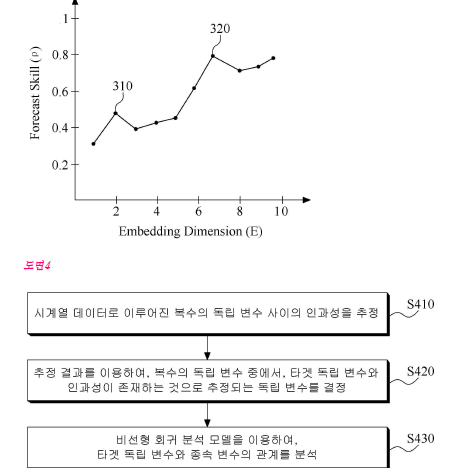
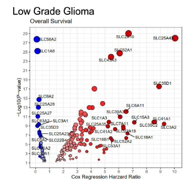
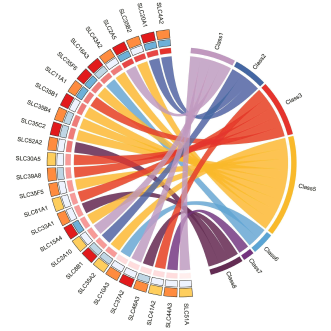
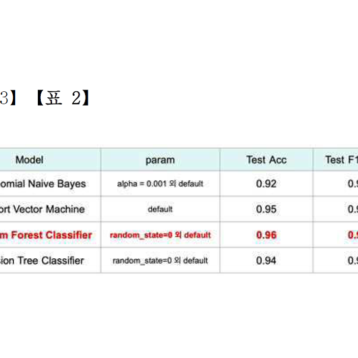
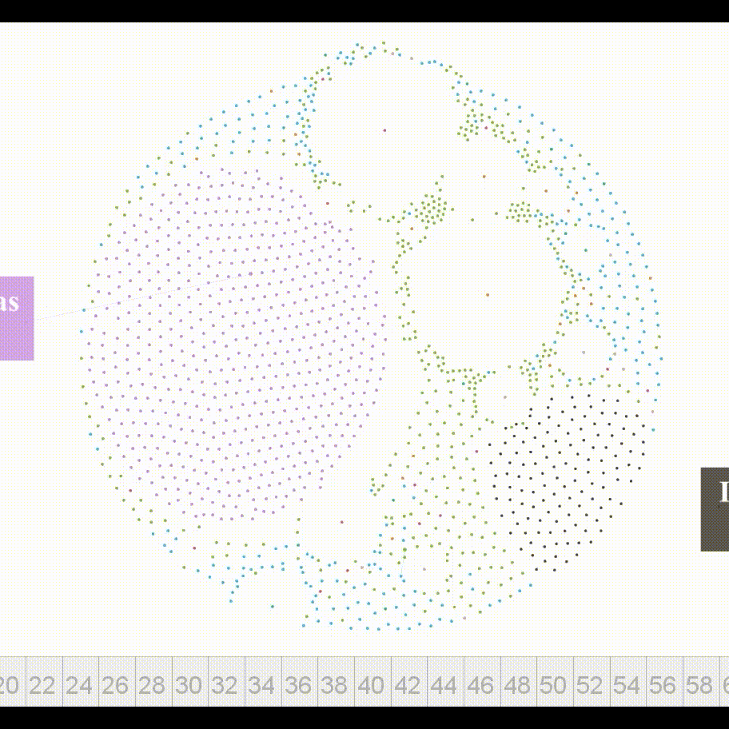
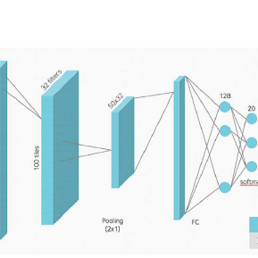
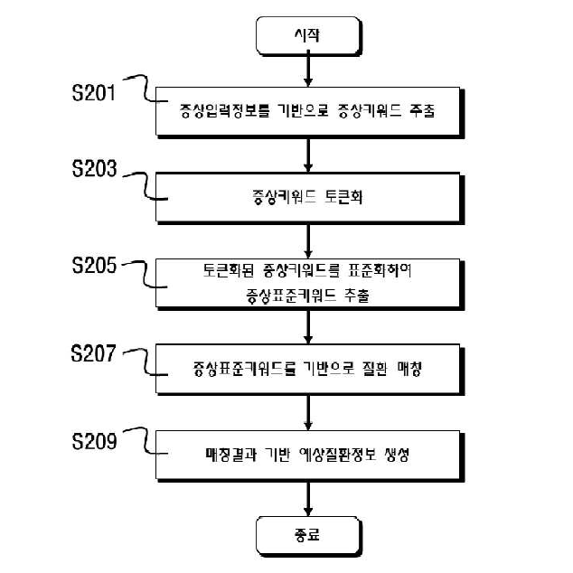

---
hide:
  - toc
---

# Patents and Technologies

-   {width=450px}

    ### 미세 먼지를 포함하는 대기 오염 물질에 대한 인체 위험도를 추정하기 위한 빅데이터 분석 방법

    2019 보건복지부 신진의료기술 **장관표창 수상**

-   {width=450px}

    ### 인공지능과 다중 데이터베이스 기반 악성교모세포종에서 용질 운반체 바이오마커 및 항암 치료제 개발 방법

    CHOMedicine **산학협력연구성과**

-   {width=450px}

    ### 뇌종양 진단 또는 예후 예측용 용질 운반체 바이오마커 조성물

    CHOMedicine **산학협력연구성과**

-   {width=450px}

    ### 인공지능 기반의 증상 및 질환 매칭을 위한 챗봇 서비스 제공방법

    CHOMedicine **산학협력연구성과**

-   {width=450px}

    ### 감염병의 전파 경로를 시각화하는 방법

    2022 보건복지부 보건의 날 **장관표창 수상**

-   {width=450px}

    ### 인공지능 기반의 암종별 타겟 선정 및 암종 예측 방법

    CHOMedicine **산학협력연구성과**

-   {width=450px}

    인공지능 아바타 기반의 예비문진 및 비대면 진료 매칭서비스 제공방법

    CHOMedicine **산학협력연구성과**

- 

