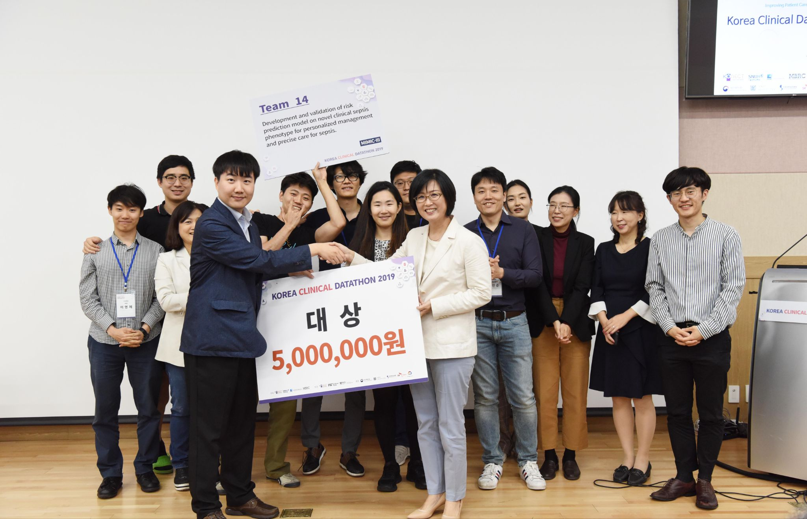

---
hide:
  - toc
  - navigation
---

# **성균관대학교 의과대학 의료빅데이터연구실**

-   :material-school: [**연구실 소개**](about/index.md)

    의료빅데이터연구실을 소개합니다.

  - :material-account-supervisor: [**연구책임자**](about/members/professor.md)

    연구실의 연구책임자를 소개합니다.

-   :material-account-group: [**연구진**](about/members/members.md)

    연구실의 연구진을 소개합니다.

-   :material-microscope: [**연구분야**](field_of_study/index.md)

    연구실에서 다루는 주요 연구분야를 소개합니다.

-   :material-file-document: [**연구성과**](achievements/highly_cited.md)

    연구실의 주요 연구성과를 소개합니다.

-   :material-file-document-edit: [**연구모집**](recruitment.md)

    공고된 과제에 함께할 연구원을 모집합니다.

 

{width="40%" align="left"}

성균관대학교 의과대학 의료빅데이터연구실은 4차 산업혁명 시기 새로운 의학 연구의 혁신을 선도할 수 있는
최고 수준의 글로벌 빅데이터, 디지털 헬스, 의료 인공지능 연구자를 양성하고 있습니다.

The Medical Big Data Lab at Sungkyunkwan University School of Medicine is
cultivating top-notch global big data, digital health, and medical artificial intelligence researchers
who can lead new medical research innovations during the Fourth Industrial Revolution.

**2024.02. 기준 SCI(E) 201편,
평균 Impact Factor 11.99,
총 피인용 4460회**

[Google Scholar](https://scholar.google.co.kr/citations?hl=ko&user=8mIJ8mcAAAAJ&sortby=pubdate){ .md-button }
[Recent News](about/news){ .md-button }
[Contact Us](about/index.md#contact-us){ .md-button }
